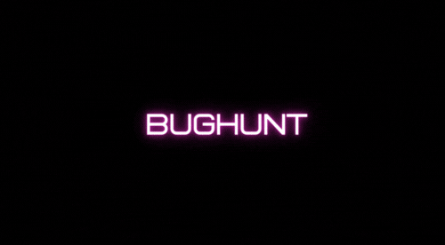
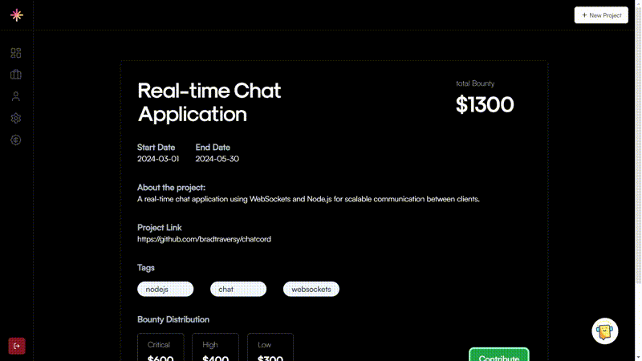
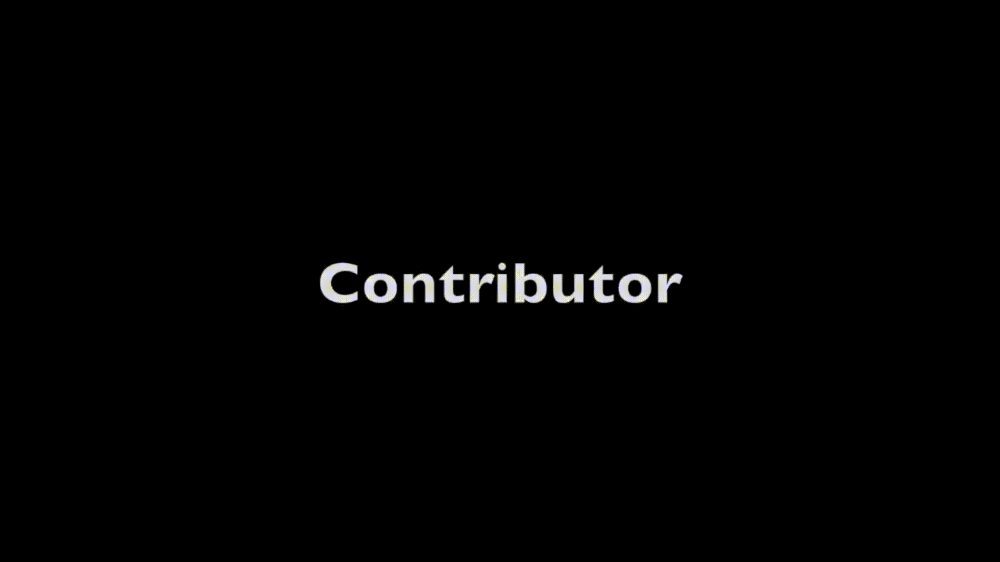
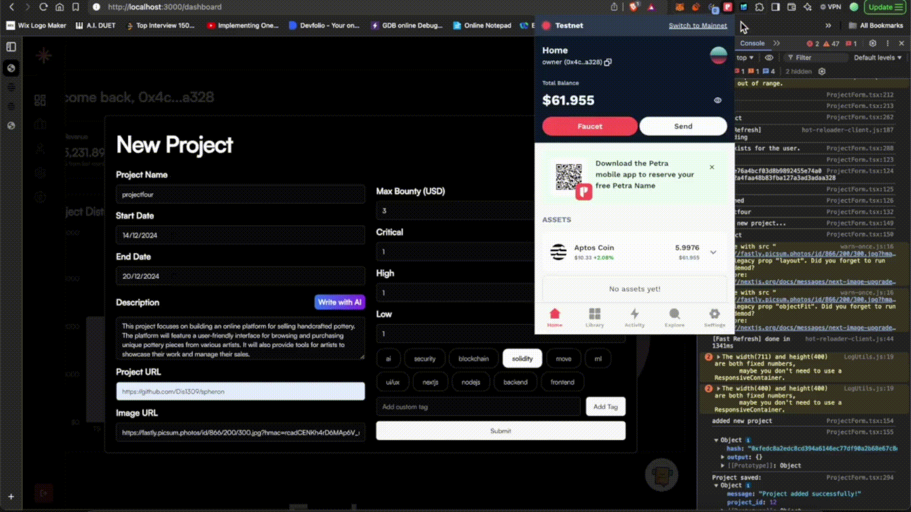
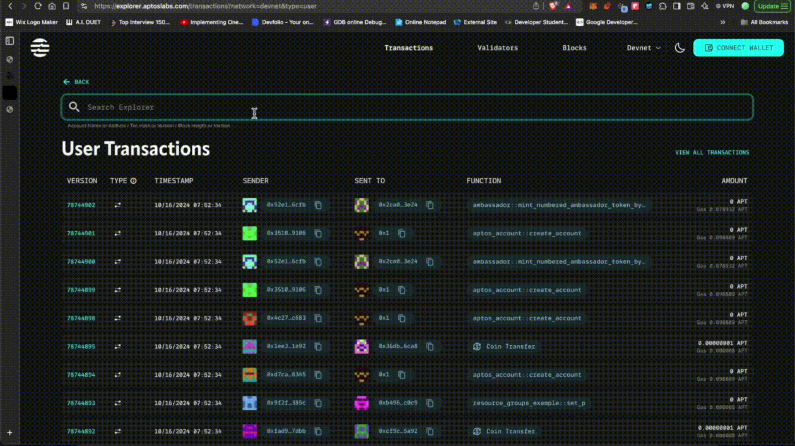
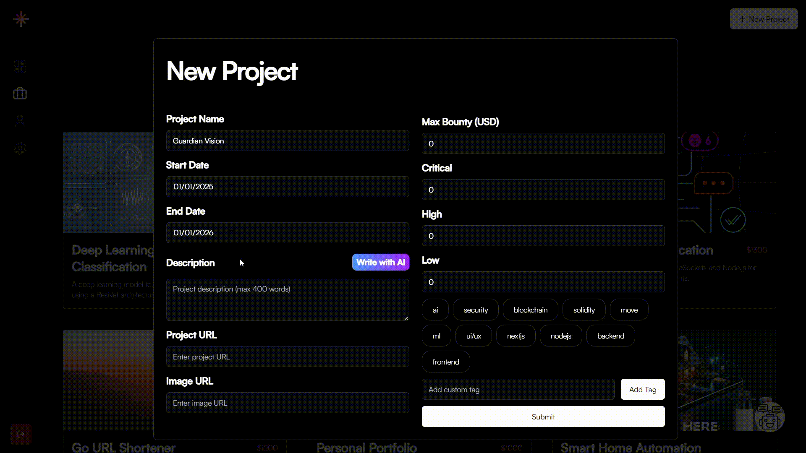

<a name="readme-top"></a>

<!-- PROJECT LOGO -->
<br />
<h1 align="center">BugHuntX: Next-Generation Decentralized Bug Bounty Platform</h1>
<div align="center">
  <a href="https://github.com/Dis1309/spheron">
    
  </a>
</div>
<p align="center">
    Welcome to the future of bug bounty platforms, where we leverage the power of blockchain, NFTs, and AI to revolutionize security processes. Built on the Move language and deployed on Aptos blockchain, this platform provides a decentralized, secure, and transparent way for non-tech savy project owners and technically eliquent contributors to collaborate and earn.
  <br />
  <a href="https://youtu.be/qybtwzmaOis"><strong>Explore the Demo »</strong></a>
  <br />
  <br />
  <a href="https://github.com/Dis1309/spheron/issues">Report Bug</a>
  ·
  <a href="https://github.com/Dis1309/spheron/issues">Request Feature</a>
</p>


<!-- TABLE OF CONTENTS -->
<details>
  <summary><h2>Table of Contents</h2></summary>
  <ol>
    <li><a href="#about-the-project">About The Project</a></li>
    <li><a href="#mission">Mission</a></li>
    <li><a href="#key-features">Key Features</a></li>
    <li><a href="#visuals">Visual Representation</a></li>
    <li><a href="#why-bughuntx">Future Prospects</a></li>
    <li><a href="#built-with">Built With</a></li>
    <li>
      <a href="#getting-started">Getting Started</a>
      <ul>
        <li><a href="#installation">Installation Instructions</a></li>
        <li><a href="#example">Example Usage</a></li>
      </ul>
    </li>
    <li><a href="#contract">Contract Addresses</a></li>
    <li><a href="#team">Team</a></li>
  </ol>
</details>


<h2 id="about-the-project">About The Project</h2>

Our decentralized bug bounty platform is reshaping the future of project development by bridging the gap between ideas and technical knowledge. Using blockchain technology, each project is listed as an NFT, giving contributors a verifiable source of truth. Built on the Aptos blockchain using the Move language, we offer secure, transparent, and efficient payments through smart contracts—ensuring that contributors are fairly compensated based on the issues they resolve.

<h2 id="mission">Mission:</h2>

We aim to provide a **seamless, secure, and transparent bug bounty experience** for both project owners and contributors. By decentralizing the process, our platform **removes intermediaries, reduces delays**, and ensures **real-time payments** for contributors who resolve issues.

Additionally, we focus on **bridging the gap between creativity and technical knowledge deficiency**. Anyone with an innovative idea but lacking the technical resources can come to our platform, describe their vision, and **connect with technically knowledgeable contributors** who can bring their ideas to life.

With our platform, project owners can transform their concepts into reality, while contributors gain the opportunity to apply their skills in impactful ways and earn money.

<h2 id="visuals">Visual Representation</h2>


*The above diagram illustrates the process flow from project listing to vulnerability reporting and payment distribution.*

<p align="right">(<a href="#readme-top">back to top</a>)</p>

<h2 id="key-features">Key Features</h2>

1. **Project Listing as NFTs**:  
   Every project on our platform is tokenized as a unique NFT. This ensures **transparency**, *immutability*, and a **trustless** environment. Contributors can verify the project’s authenticity and ownership directly on the blockchain, eliminating potential fraud and manipulation. By leveraging the decentralized nature of NFTs, project owners can prove that the project details are securely stored and immutable.They can further sell their NFT on marketplace to earn in exchange of their ownership rights.

   <div align="center">
        
    </div>


2. **AI-Assisted Issue Categorization**:  
   **AI integration** allows our platform to categorize issues based on their severity efficiently. By using cutting-edge machine learning models trained on vast security data, our AI system automatically assigns issues into the appropriate tiers: **Critical**, **High**, or **Low**. This saves project owners time and reduces manual evaluation efforts while improving accuracy in identifying priority vulnerabilities.

   <div align="center">
        
    </div>
    
3. **AI-Powered Chatbot (Built with RASA)**:  
   Our platform includes an **AI-powered chatbot** built with **RASA**, designed to provide an interactive experience for users. The chatbot helps users by:
   - Answering questions about specific projects
   - Offering suggestions for projects that align with users’ skills and interests
   - Categorizing and assisting with project selection, ensuring users find the most relevant bounties

   By integrating **RASA**, we deliver a sophisticated, conversational AI experience, ensuring users can navigate the platform efficiently and get real-time project-related information without any hassle.

    <div align="center">
      <a href="https://github.com/Dis1309/spheron">
        
      </a>
    </div>

4. **Decentralized Contribution Management**:
    Project owners can view all contributions related to their projects through a decentralized interface. Using **NFT-based** project tracking, each contribution is represented by a unique token, securely stored on the blockchain. Owners can approve or reject these contributions based on their quality. Upon approval, contributors are automatically rewarded through smart contracts, ensuring a transparent and tamper-proof process. This decentralized storage model, built on Spheron, guarantees that project data remains secure and immutable, with no reliance on centralized servers.

  <div align="center">
        
    </div>

5. **Personalized AI Recommendations**:  
    Our platform leverages **advanced AI** algorithms to provide personalized project and issue recommendations tailored to each contributor's skills and expertise. By analyzing user profiles and project data, the AI ensures that contributors are matched with the most relevant tasks, maximizing their impact and productivity while aligning with their strengths. This intelligent system enhances the quality of contributions and helps contributors tackle challenges best suited to their abilities.

    <div align="center">
        
    </div>

6. **Dynamic Bounty Distribution**:  
   Our platform provides a flexible, tier-based bounty distribution system, enabling project owners to allocate rewards dynamically. Based on the severity of identified vulnerabilities, contributors are compensated under **Critical**, **High**, and **Low** tiers. This ensures fair and **meritocratic distribution** of rewards, motivating bug hunters to resolve more significant security issues for higher incentives.

   <div align="center">
        
    </div>

7. **Automated Transaction Management**:  
   To ensure **trust** and **transparency** between contributors and project creators, the bounty payments are securely held in **smart contracts** while the bounty is live. Once the bounty ends, the funds are automatically distributed among contributors based on their contributions. This feature eliminates manual handling of payments, reducing human error and increasing fairness.

   <div align="center">
        
    </div>
    
8. **Blockchain-Backed Payments**:  
   Payments on our platform are facilitated through blockchain-backed smart contracts. Contributors are paid directly and securely in cryptocurrency after completing their tasks. Our smart contracts ensure **instant**, *transparent*, and **trustless** transactions without intermediaries, giving contributors peace of mind and a secure payment gateway.

   <div align="center">
        
    </div>

9. **Secure Contributor Rewards**:  
   For contributors, the platform offers **end-to-end security** using Spheron’s decentralized storage, ensuring that all contributions and rewards remain transparent and secure. Once a contribution is approved by the project owner, the contributor is rewarded via a smart contract, eliminating the need for intermediaries. This blockchain-based solution guarantees that contributors receive their rewards without any risk of tampering or delay, as all transactions are verifiable on the public ledger.

   <div align="center">
        
    </div>

10. **Write With AI**:  
    Our platform includes an innovative Write with AI feature that allows users to generate project descriptions automatically using AI-powered assistance. This feature leverages cutting-edge natural language processing models to create detailed and contextually accurate descriptions based on the project details provided by the user.

    <div align="center">
      <a href="https://github.com/Dis1309/spheron">
        
      </a>
    </div>
    
11. **NFT Marketplace**:  
    Our platforms also allows users to sell thier tokens to other people so that they can also earn money in exhange of the project they build. This ensures that the Project owners also do not incurr any losses in case they are not willing to ove forward with the project they once found interesting.

    <div align="center">
      <a href="https://github.com/Dis1309/spheron">
        
      </a>
    </div>

---

Here’s the revised section that introduces the code snippet, focusing on the **Dynamic Bounty Distribution** feature implemented in Move language:

### Code Snippets to Highlight Features:

For the **Dynamic Bounty Prize Distribution** feature, here’s how smart contracts can dynamically allocate bounties based on issue severity using Move:

```move
public entry fun transaction_winners(
        deployer: &signer,
        project_id: u64,
        high: u64,
        critical: u64,
        low: u64
    ) acquires ProjectMapping, {
       let project_mapping = borrow_global<ProjectMapping>(@account_address);
       let all_projects = project_mapping.projects;
       let projectMain =simple_map::borrow(&mut all_projects,&project_id);
       let project = projectMain.contributors;
       let len = vector::length(&project);
        let mp:SimpleMap<address,u64> = simple_map::create(); 
       for (i in 0..len) {
         let contributor = vector::borrow(&project,i);
         let amount:u64 = 0;
         
         if(contributor.level ==  string::utf8(b"High")) {
           amount = projectMain.high_bounty/high;
         } else if(contributor.level ==  string::utf8(b"Critical")) {
           amount = projectMain.critical_bounty/critical;
         } else amount = projectMain.low_bounty/low;

         if(simple_map::contains_key(&mut mp,&contributor.issuer)==false) {
             simple_map::add(&mut mp, contributor.issuer,amount); 
         } else {
            let tmp:u64 = *simple_map::borrow(&mut mp,&contributor.issuer);
            amount = amount + tmp;
            simple_map::upsert(&mut mp,contributor.issuer,amount );
         };
       };
       for (i in 0..len) {
         let contributor = vector::borrow(&project,i);
         if(simple_map::contains_key(&mut mp,&contributor.issuer)==true) {
            let value = *simple_map::borrow(&mut mp,&contributor.issuer);
            let add:address = @account_address;
            transfer(deployer, contributor.issuer, value);
         };
       };
    }
```

### Key Functions:

1. **`initialize`**: reads the required contributors of the project
2. **`allocates bounty`**: Allows the owner to allocate rewards based on the severity of reported issues (Critical, High, Low).
3. **`send bounties`**: Enables contributors to get the allocated bounties.
---

To showcase the **AI-Assisted Issue Categorization**, we developed a chatbot using **RASA** that helps users find relevant projects based on their prompts and can provide detailed information about specific projects.

### RASA Chatbot Implementation

The RASA chatbot utilizes natural language processing to understand user queries and suggest projects that align with their interests. Below is a simplified implementation highlighting key components of the RASA framework:

```yaml
# config.yml - RASA configuration file

language: en
pipeline:
  - name: WhitespaceTokenizer
  - name: CountVectorsFeaturizer
  - name: DIETClassifier
  - name: EntitySynonymMapper
  - name: ResponseSelector
  - name: DialoguePolicy

# domain.yml - RASA domain file
intents:
  - greet
  - ask_projects
  - request_details

responses:
  utter_greet:
    - text: "Hello! How can I assist you today?"
  utter_ask_projects:
    - text: "I can help you find projects based on your interests. What are you looking for?"
  utter_project_details:
    - text: "Here are the details of the project you're interested in: {project_name}"

# stories.yml - Example user stories
stories:
  - story: greet and ask for projects
    steps:
      - intent: greet
      - action: utter_greet
      - intent: ask_projects
      - action: utter_ask_projects
```

### Key Features:

1. **Project Recommendations**: The chatbot understands user prompts to suggest relevant projects based on their interests and requirements.
2. **Detailed Information**: Users can request more information about specific projects, and the chatbot provides insights on features, technology stacks, and more.
3. **Interactive Experience**: Users can engage in a conversation with the chatbot, making it easier to find projects that suit their needs.

This RASA-powered chatbot enhances user experience by leveraging AI to provide tailored project recommendations and information, streamlining the process of finding suitable projects within our platform.

<p align="right">(<a href="#readme-top">back to top</a>)</p>

### Future Prospects

1. Cross-Chain and Multi-Blockchain Integration
Interoperability: You could expand your platform to support other blockchains (besides Aptos), allowing users to choose which blockchain best fits their project. This increases flexibility and attracts a wider audience.
Cross-Chain Bounties: Introduce cross-chain bug bounty programs where projects and rewards can be hosted on multiple blockchains, encouraging contributors from various ecosystems to participate.

2. Enhanced Security Tools for Contributors
Automated Vulnerability Scanners: Offer contributors AI-based automated vulnerability scanning tools that can provide them with a head start on identifying potential issues in a project.
On-Chain Auditing: Develop on-chain auditing mechanisms where projects can be automatically audited and verified for their security practices before being listed, providing an additional layer of trust.

3. Reputation System
Introduce a tokenized reputation system where contributors build reputation scores based on their work quality. High-reputation contributors could access exclusive bounties or higher-tier projects.

4. Real-Time Collaboration Tools
 Develop real-time collaborative environments where contributors can work together on issues. Contributors can stream their debugging sessions, share screens, or collaborate in real-time while solving complex problems.

5. AI-Powered Bug Bounty Prediction
Using machine learning models, you could predict potential areas in a project that are most vulnerable, giving contributors an edge and improving overall platform effectiveness.

6. Metaverse-Enabled Bug Bounties
Explore creating virtual spaces in the metaverse where contributors can collaborate and solve issues together, providing a more immersive experience.

---

<p align="right">(<a href="#readme-top">back to top</a>)</p>

<h2 id="built-with">Built With</h2>


- **Blockchain Platform**: Aptos Blockchain
- **Smart Contracts**: Written in Move Language
- **AI**: Automated Issue Categorization
- **Payments**: Cryptocurrency Transactions via Blockchain

<p align="right">(<a href="#readme-top">back to top</a>)</p>

<h2 id="getting-started">Getting Started</h2>

<h3 id="installation">Installation Instructions:</h3>

## Prerequisites

1. **Petro Wallet**: Make sure you have a Petro Wallet to connect. You can either:
   - Download the Petro Wallet from the Chrome Extension Store.
2. **Web2 Onboarding**:Without Petro wallet one can also onboard using gmail.
   - Alternatively, sign in using Google for Web2 onboarding (No need of wallet).

Once you have the prerequisites, follow these steps to set up the bug bounty platform locally:

## Setup Instructions

1. **Clone the repository**:
   ```bash
   git clone https://github.com/Dis1309/spheron
   ```

2. **Navigate to the project directory**:
   ```bash
   cd web
   ```

3. **Install dependencies**:
   ```bash
   npm install
   ```


<h3 id="example">Example Usage:</h3>

To see the platform in action, check out the demo or refer to the example usage guide in the documentation:

Here's the adjusted content presented as a topic within the same page, maintaining coherence and clarity:

---

## **Demo**  
[**Watch the Demo**](https://youtu.be/qybtwzmaOis)

### **Example Workflow**  

Here’s a detailed overview of our decentralized project management platform, structured to present everything clearly and visually engaging. This includes outputs in the form of images and GIFs to enhance understanding.

---

<h2 id="technology-stack">Technology Stack</h2>

- **Blockchain Technology**: Aptos
- **Smart Contracts Language**: Move, rust
- **Web Framework**: Next.js, Node.js
- **Languages**:Typescript, Javascript
- **Integration**- wallet-adapter, Provider, Typecript-sdk, petra-wallet
- **Database**: MongoDB
- **Styling**: TailwindCSS,Shadcn/ui,acertanityui, gsap animaton library
- **AI Frameworks**: TensorFlow, Keras, RASA
- **Version Control**: Git

<p align="right">(<a href="#readme-top">back to top</a>)</p>

<h2 id="contract">Contract Addresses</h2>

Module Address                                                                                     
--------------------------------------------------------------------------------------------
| Account Address| 0x7bf84486bf9b0e0b96226927e6f3c1b5a35c96ef4d8300f699d8341ef50aa35b                                                                             
| Module Address | 0x7bf84486bf9b0e0b96226927e6f3c1b5a35c96ef4d8300f699d8341ef50aa35b    

<a href="https://testnet.tracemove.io/account/0x7bf84486bf9b0e0b96226927e6f3c1b5a35c96ef4d8300f699d8341ef50aa35b"> Check-Out Module Address On Aptos Testnet Scan</a>

<p align="right">(<a href="#readme-top">back to top</a>)</p>

<h2 id="call-to-action">Get Involved</h2>

Join us in revolutionizing bug bounty platforms! Whether you're a security researcher, a project owner, or an enthusiast, we welcome you to contribute, report bugs, or share your feedback. 

- **Contribute to Development**: Check our [GitHub Repository](https://github.com/Dis1309/spheron) for contribution guidelines.
<p align="right">(<a href="#readme-top">back to top</a>)</p>

## Meet the Team

<table cellpadding="0" align="center">
  <tr style="padding: 0">
    <td valign="top"><div width="20%">
      
      <h3>Kashish Garg</h3>
      <p>AI-ML Developer</p>
    </div></td>
    
   <td valign="top"><div width="20%">
      
      <h3>Disha Dwivedi</h3>
      <p>Blockchain Aptos Developer</p>
    </div></td>

  <td valign="top"><div width="20%">
      
      <h3>Vanshika Malik</h3>
      <p>Full Stack Developer</p>
    </div></td>

   <td valign="top"><div width="20%">
      
      <h3>Aviral Katiyar</h3>
      <p>AI-ML Developer</p>
    </div></td>

  <td valign="top"><div width="20%">
      
      <h3>Jyothika</h3>
      <p>Blockchain Aptos Developer</p>
    </div></td>
  </tr>
</table>


<p align="right">(<a href="#readme-top">back to top</a>)</p>
